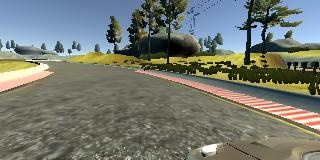
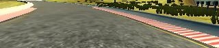
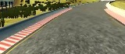
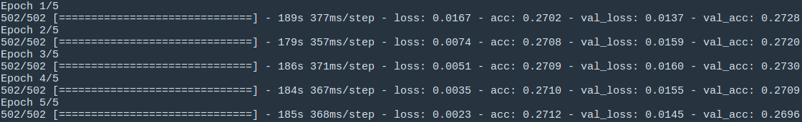

# **Behavioral Cloning** 

The goals / steps of this project are the following:
* Use the simulator to collect data of good driving behavior
* Build a convolution neural network in Keras that predicts steering angles from images
* Train and validate the model with a training and validation set
* Test that the model successfully drives around track one without leaving the road
* Summarize the results with a written report

#### 1. Files Included in Folder

My project includes the following files:
* model.py : a pipeline to train and valid the CNN for behavioral cloning
* drive.py : for driving the car in autonomous mode
* model.h5 : containing a trained convolution neural network 
* network.py: defines a neural network structure used by the project
* Data_processing.py : defines a class that includes all the methods necessary to process the training and validation data

#### 2. Neural Network used for Task

The network used for training comes from Nvidia's work on ["End-to-End Deep Learning for Self-Driving Cars"](https://devblogs.nvidia.com/deep-learning-self-driving-cars/?source=post_page---------------------------), the original network uses normalized 66x200x3 images as the input, and the output is obtained after 4 fully connected layers. In this project, the image from simulator is 160x320x3, which is later cropped to 70x130x3 to remove the regions out of lane. The cropped image is used as the input to the CNN. In [Erik Shestopal's blog](https://medium.com/@erikshestopal/udacity-behavioral-cloning-using-keras-ff55055a64c), it is also suggested to use BatchNormalization on the CNN layers instead of using Dropout on the fully connected layers, the technique is also adopted for this implementation.

#### 3. Image processing Methods

* The image data processing methods are grouped in a *Class* which makes the data flow between each methods in the class easy and clear.   
* The *Class* includes the following methods:
   - *def import_data():* read each row from the driving_log.csv and append that as elements of self.data list  
   - *def data_sets():* seperate training and validation data from the self.data list with a given split ratio  
   - *def data_generator():* split input data sets as batches,here the input data sets can be either training set or validation set. Within each batch, take out one example and augment the data. Here, one example is one row from the drive_log.csv, which contains addresses for *center*,*left* and *right* images as well as the steering angle. These data are augmented and made availabe for the training. A full batch of augmented data is available and output by the *generator*.   
   - *def train_generator(), def valid_generator():* specific data generator for training and validation data. They have to be made since *model.fit_generator()* requires function() object as their parameters.  
   - *def augment_batch():* one data sample will be augmented to 4 samples after the augmentation. The original image is read in by CV2 in BGR color mode, and has to first be converted to RGB, as shown below:  
     

   The image is then croped to only contain the lane pixels, as shown below:  
      

   The image is resized to 70x160x3 as required by the model at last, as shown below:  
     
  
  All of the three images are processed the same way, while for the center image, extra fliping operation is performed to generate the forth augmented image, which is shown below:  
   
  
  As for the steering angles, the fliping image will have the same angles as original with negative sign. The steering angles for left and right camera images will have a correction angles added to the original steering angle so as to train the car with ability of 'centering' itself when it's off-line.  
  
#### 4. Train the Model

In *model.py* , the network definition and data processing class are imported first. A function called 'pipeline' is defined to do the training, where batch size, epoch number are specified, model and data processing object are instantiated. model.fit_generator() method is used to do the training, and using 5 epoches with 502 batches per epoch, the training and validation results are shown as below:  

