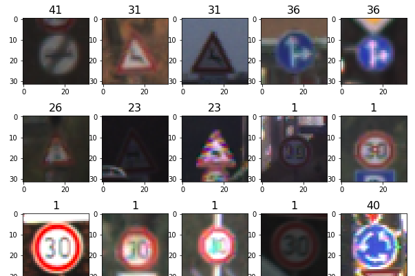
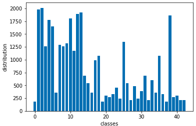
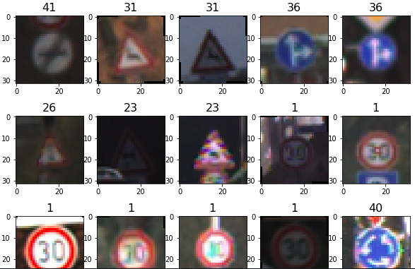
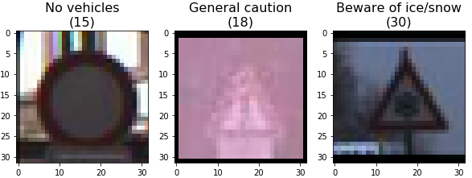

# **Traffic Sign Recognition** 

**Build a Traffic Sign Recognition Project**

The goals / steps of this project are the following:
* Load the data set (see below for links to the project data set)
* Explore, summarize and visualize the data set
* Design, train and test a model architecture
* Use the model to make predictions on new images
* Analyze the softmax probabilities of the new images

### Data Set Summary & Exploration

#### 1. Provide a basic summary of the data set. In the code, the analysis should be done using python, numpy and/or pandas methods rather than hardcoding results manually.

The data set used for this work is the [GTSRB - German Traffic Sign Recognition Benchmark](http://benchmark.ini.rub.de/?section=gtsrb&subsection=dataset). The working data set has been preprocessed to be 32x32 by size, and divided into training, validation and test sets. Using basic numpy commands, the following shows some information on the data sets:

* The size of training set is 34799
* The size of the validation set is 4410
* The size of test set is 12630
* The shape of a traffic sign image is 32x32x3
* The number of unique classes/labels in the data set is 43

#### 2. Include an exploratory visualization of the dataset.

Here is an exploratory visualization of the data set with the labels of each image shown on top. 

A histogram is also made to get the statistical distribution of training set, with y-axis the actual number of images for each class. It can be seen that training data does not have a uniform distribution over the whole classes.

### 3. Design and Test a Model Architecture

For actual training data to the network, RGB image instead of grayscale image is used, because CNN is designed for multi-channel input data, and color channels provide more information on the object to be classified. The comparison on using the same network and image processing method on both RGB and grayscale images can be done later for interest.

Two basic data processings are used:(1) normalization, which converts each image pixel to value between [0,1] (2)image rotation: each image is rotated either [1,15] degree or [-1,-15] degree, the rotation direction is chosen randomly, the rotation angle is also chosen randomly. The implementation below only enables [1,15] option, PIL rotation function gives some unpredicted result when rotation angle > 180 degree.

The reason to use normalization is to convert data set into a fix range, so weights after training won't have huge magnitude difference. The reason to rotate images is to introduce more randomness to the training set so the network won't 'remember' a particular data pattern. 

The following shows processed images, the rotation can be seen from some images.

My final model consisted of the following layers:

| Layer         		|     Description	        					| 
|:---------------------:|:---------------------------------------------:| 
| Input         		| 32x32x3 RGB image   							| 
| Convolution 3x3x3x32     	| 1x1 stride, valid padding, outputs 30x30x32 	|
| RELU					|												|
| Max pooling	 2x2     	| 2x2 stride, vaid padding outputs 15x15x32 				|
| Convolution 3x3x32x64    |  1x1 stride, valid padding, outputs 13x13x64		|
| RELU					|												|
| Max pooling	 2x2     	| 2x2 stride, vaid padding outputs 6x6x64 |
| Convolution 3x3x64x128    |  1x1 stride, valid padding, outputs 4x4x128		|
| RELU					|												|
| Max pooling	 2x2     	| 2x2 stride, vaid padding outputs 2x2x128 |
| Fully connected	1	| outputs 512        									|
| Fully connected	2	| outputs 800       									|
| Fully connected	3	| outputs 400       									|
| Fully connected	4	| outputs 43       									|

To train the model, I used an Adam optimizer on batch size of 128 for epochs of 15. There are interations on chosing the fully connected layer architecture. At first, when the CNN is flattened to have 512 neurons, it is directly shrink down to 256 and then to 43. Using this architecture, the validation accuracy can not go up to 93%, the reason might be an underfitting on the training set because of inadequate neurons to capture the complete features of the training data. Therefore, an augmented layer from 512 neurons to 800 neurons is inserted before it's shrink down to 43. It can be seen that at the first 5 epochs, the validation accuracy 'saturate' slower, and with 5 extra epochs, the validation accuracy finally goes above 93%.

### Test a Model on New Images

Here are example German traffic signs used for testing the classifier. THe signs are visually difficult to classify by human eyes, therefore, they are good to test if CNN classifier real shines. The correct label and description of them are printed on top.

Here are the results of the prediction:

| Image			        |     Prediction	        					| 
|:---------------------:|:---------------------------------------------:| 
| no vehicles     		| no vehicles  | 
| general caution    			| general caution 		|
| be aware of ice/snow					| be aware of ice/snow			|
| keep right      		| keep right		|
| end of speed limt (80km/h)			| end of speed limt (80km/h)   |
| no passing | no passing |

The model was able to correctly classify all of the signs with accuracy of 100%. This is really amazing, since some of the signs are almost impossible to classify by human eyes. To further check if the neuroal network is also 'guessing' or 'predicting', the softmax of top 5 predictions can be used to verify. 

For the first image, the label is 15, and the top 5 softmax outputs are

| Probability         	|     Prediction	        					| 
|:---------------------:|:---------------------------------------------:| 
| 1.00000000e+00        			|15   									| 
| 5.39594980e-10    				| 9										|
| 3.29274975e-11					| 26										|
| 3.76289339e-14	      			| 8				 				|
| 2.49058603e-14			    | 22     							|

For the other 5 images, the classifier outputs similar distribution of nearly 100% sure on what it's 'seeing' (which can be seen from the notebook). Therefore, on this traffic sign classification task, neural network achieves better performance than human.

### 4. Additional Learning References
(Special thanks to Udacity project reviewer for providing the following learning material)

Regarding training data processing:
* [Comparing different grayscaling techniques](https://journals.plos.org/plosone/article?id=10.1371/journal.pone.0029740)
* [A simplified Mathematical presentation of convolution networks and their different layers and operations](https://arxiv.org/pdf/1603.07285.pdf)
* [A detailed look into the benefits and pitfalls of data augmentation](https://arxiv.org/pdf/1609.08764.pdf)
* [A really cool project that implements a traffic sign classifier as a mobile app](https://github.com/OluwoleOyetoke/Accelerated-Android-Vision)
* [Histogram equalization (CLAHE). This is a technique for adjusting image intensities to enhance contrast.](https://docs.opencv.org/3.1.0/d5/daf/tutorial_py_histogram_equalization.html)
* [Other options available for data preprocessing](http://cs231n.github.io/neural-networks-2/#datapre)

Regarding neural network training:
* [Dropout](https://pgaleone.eu/deep-learning/regularization/2017/01/10/anaysis-of-dropout/)
* [Batch normalization](http://cs231n.github.io/neural-networks-2/#batchnorm)
* [elu activation](https://arxiv.org/abs/1511.07289)
* [Leaky ReLUs](https://datascience.stackexchange.com/questions/5706/what-is-the-dying-relu-problem-in-neural-networks?utm_medium=organic&utm_source=google_rich_qa&utm_campaign=google_rich_qa)
* [Tensor Board](https://www.tensorflow.org/guide/graph_viz)
* [Cyclical learning rate](https://arxiv.org/abs/1506.01186)
* [Hyperparameters optimization](http://cs231n.github.io/neural-networks-3/#hyper)
* [Example traffic sign classification](https://medium.freecodecamp.org/recognizing-traffic-lights-with-deep-learning-23dae23287cc)
* [Example traffic sign classification on mobile](https://proandroiddev.com/mobile-intelligence-traffic-signs-classification-with-retrained-mobilenet-model-71b698d08ba0)

Data Visulization:
* [tutorial](https://medium.com/@awjuliani/visualizing-neural-network-layer-activation-tensorflow-tutorial-d45f8bf7bbc4)

Additinal references:
* [Bag of Tricks for Image Classification with Convolutional Neural Networks](https://arxiv.org/pdf/1812.01187.pdf)
